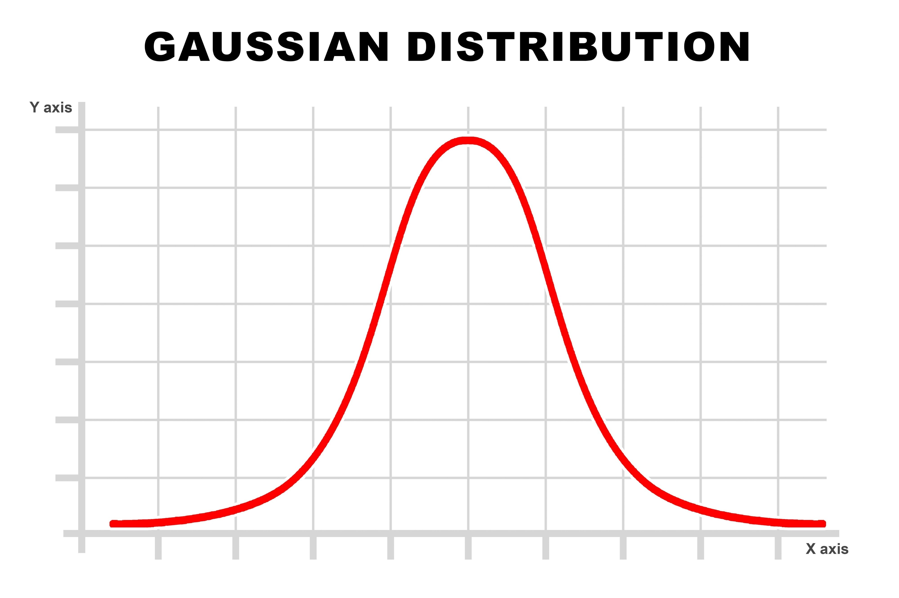
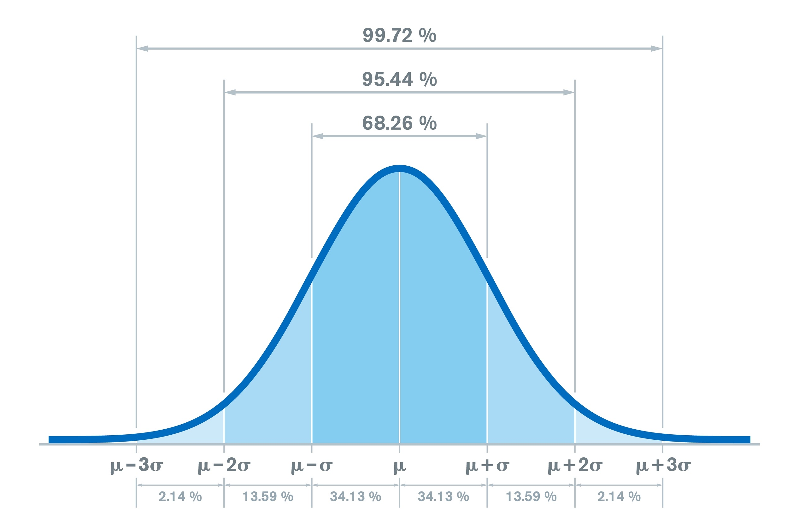

## Core Differences at a Glance

| Feature       | Uniform Distribution                                 | Standard Normal Distribution                          |
|---------------|------------------------------------------------------|------------------------------------------------------|
| **Shape**     | Rectangular (flat top)                               | Bell-shaped (symmetrical curve)                      |
| **Probability** | Every outcome in the range is equally likely.      | Outcomes near the center are most likely; tails are rare. |
| **Parameters** | Defined by a minimum ($a$) and maximum ($b$).       | Fixed: Mean ($\mu$) = 0, Std Dev ($\sigma$) = 1.    |
| **Visual**    | ▭ Rectangular density (flat)                         | 🔔 Bell curve (normal)                               |

### 1. Uniform Distribution (The "equal" choice)

In a uniform distribution, there is no "
average" value that happens more often than others. If you are looking at a range between `a` and `b`, every single number in that range has the exact same probability of being picked.

- **Example:** A perfectly fair die. Every number (1 through 6) has exactly a 1 / 6 chance of appearing.
- **Standard Uniform:** A specific version where the range is exactly between 0 and 1

### 2. Standard Normal Distribution (The "average" choice)

The "Normal" distribution is the famous bell curve where most data points cluster around the middle(the mean). The Standard version is a normalized version used to compare different data sets.

- **The Rule:** It always has a mean of `0` and a standard deviation of `1`
- **Example:** Human height or IQ scores. Most people are near the average, and as you move toward extreme heights (very tall or very short), the number of people drops off significantly

### Intinition

- **Predictablity:** If you pick a number from a **Uniform** distribution, you have no idea if it will be high, low, or middle - they are equally likely.

- **Predictablity:** If you pick a number from **Standard Normal** distribution, you can be **68% certain** it will be between -1 and 1, because the data naturally hugs the center.